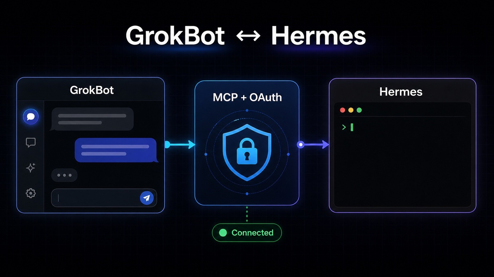

# Guided setup tutorial

This walkthrough stays on the local clone. It uses `mcp.example.com` as the
only hostname. Replace that placeholder later on your machine; do not commit a
live domain, owner code, or Hermes path.

The architecture sketch below is fictional and contains no operator data.
It was generated with ImageGen specifically for this public repository.



## Why not install Hermes directly in the Grok Bot VM?

You can. If you want a brand-new, self-contained Hermes instance and the VM
is persistent enough for its state, installing Hermes directly in that VM may
be the simplest architecture.

That is not the objective of this bridge. The goal here is to let Grok Bot use
an **existing Hermes instance** that already has its configuration, memory,
skills, model access, and local tools. Installing another copy inside every
bot VM would create a separate agent whose state, credentials, updates, and
files would need to be maintained or synchronized independently.

The bridge keeps the two responsibilities separate:

- the Grok Bot VM remains an isolated, lightweight chat surface;
- the trusted Hermes machine remains the source of truth for the agent;
- only two narrow tools, `hermes_ask` and `hermes_status`, cross the boundary;
- OAuth approval is used instead of exposing SSH, a shell, or static bearer
  credentials to the VM;
- rebuilding or replacing the Grok Bot VM does not require rebuilding Hermes.

In short, a direct VM installation is valid for a fresh standalone agent. This
bridge is for reusing your established Hermes safely from Grok Bot—and, later,
from other compatible MCP clients—without duplicating it.

## 1. Prerequisites

- Linux or macOS
- Python 3.11 or newer
- A working `hermes` CLI and Hermes home directory on the same machine
- A public HTTPS front end you will configure yourself (not this installer)

You do not need `sudo`. You should not pipe a remote script into a shell.

## 2. Run the installer

Clone and launch the guided installer in one command:

```bash
git clone https://github.com/iamsupersocks/grokbot-hermes-bridge.git && cd grokbot-hermes-bridge && ./scripts/install.sh
```

If the repository is already cloned:

```bash
./scripts/install.sh
```

Review the same steps without writing files:

```bash
./scripts/install.sh --dry-run --non-interactive
```

Unattended local setup (still no remote download, no gateway start):

```bash
./scripts/install.sh --non-interactive --endpoint https://mcp.example.com/mcp
```

What the installer does:

1. Checks Python 3.11+ and refuses unsupported operating systems.
2. Creates a project-local `.venv` and runs `python -m pip install -e .`.
3. Copies `examples/env.example` to `.env.local`, writes a fresh owner code
   into that file, and sets mode `600`.
4. Calls `scripts/configure_plugin.py` so `mcp.json` and `.mcp.json` contain
   only the HTTPS `/mcp` URL.

What it does not do:

- download or execute a remote installer
- raise privileges
- print, log, or pass the owner code on the command line
- start `hermes_gateway.mcp` or bind a port
- write a production hostname unless you passed `--endpoint`

If `.env.local` already exists, the installer keeps it and only tightens the
file mode. It never overwrites an existing owner code.

## 3. Run doctor

```bash
python3 scripts/doctor.py
```

Doctor reports pass/fail checks and an exit code. It looks for Python 3.11+,
the local venv, a mode-`600` `.env.local`, a real HTTPS public base, valid
Hermes executable/home paths, and MCP configs whose `/mcp` URL has no
`headers` block. The example hostname deliberately fails until replaced. It
does not print secret values.

## 4. Finish the local environment file

Open `.env.local` only on the gateway machine and set:

```bash
HERMES_BRIDGE_PUBLIC_BASE_URL=https://mcp.example.com
HERMES_BRIDGE_ALLOWED_HOSTS=localhost,127.0.0.1,mcp.example.com
HERMES_BRIDGE_HERMES_BIN=/absolute/path/to/hermes
HERMES_BRIDGE_HERMES_HOME=/absolute/path/to/hermes-home
```

Keep `HERMES_BRIDGE_SECRET` as the generated owner code. Do not paste that
value into chat, tickets, or git. Use at least 32 characters; the installer
writes 64 hex characters.

## 5. Start the gateway yourself

The installer stops before runtime on purpose. When you are ready:

```bash
. .venv/bin/activate
set -a
. ./.env.local
set +a
python -m hermes_gateway.mcp --host 127.0.0.1 --port 8099
```

Put a trusted HTTPS reverse proxy or tunnel in front. See `deploy/` for
generic examples. Do not expose port `8099` directly.

## 6. Connect Grok Bot with OAuth and PKCE

`mcp.json` must keep this shape:

```json
{
  "mcpServers": {
    "hermes-bridge": {
      "type": "http",
      "url": "https://mcp.example.com/mcp",
      "tool_timeout_sec": 240
    }
  }
}
```

Do **not** add an `Authorization` header. Grok Bot discovers OAuth, registers
a client, and completes authorization-code + PKCE. On first connect, approve
the client in the browser with the owner code from `.env.local`. That code is
not a bearer token.

## 7. Visible pre-tool message

Grok Bot currently emits a short visible message before every tool call. The
plugin cannot hide that host-level step. The bundled skill keeps the wording
brief and stops Grok Bot from impersonating Hermes.

## 8. Recheck

```bash
python3 scripts/doctor.py
python -m unittest discover -s tests -v
python src/privacy_scan.py --root .
```

Read `SECURITY.md` before you point a real hostname at the service.
